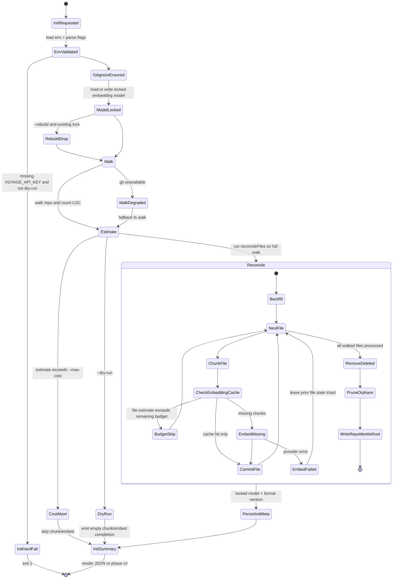
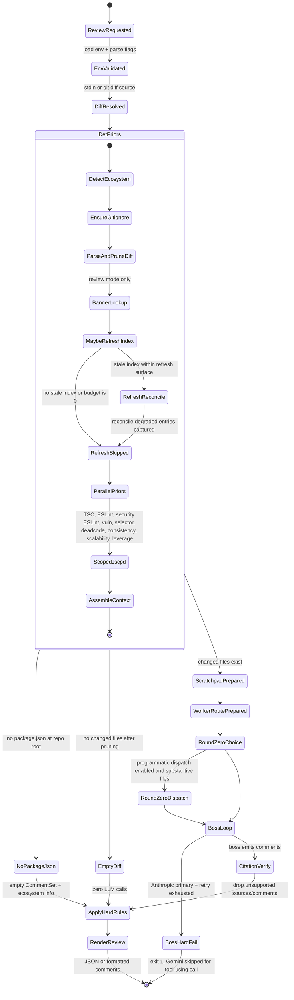

# Architecture

See [`CLAUDE.md`](../CLAUDE.md) for the slim agent index. Read [`decisions.md`](../decisions.md) before proposing architectural changes — 21 ADRs cover every major choice and rejection. [`CONTEXT.md`](../CONTEXT.md) is the noun glossary; every domain concept named below has its canonical definition there.

## What each package owns

All workspace packages publish under `@warden/*`. The CLI binary is `warden`.

- **`@warden/cli`** — Argument parsing, terminal output, the published `warden` binary. The single in-tree consumer of `@warden/core` in v0.
- **`@warden/core`** — The review engine. Takes a **`ReviewInput`**, returns a **`CommentSet`**. Owns the **review harness** (M14), **det priors** (parallel deterministic runners), the **boss loop** with **`dispatch_worker`** tool, the six **worker concerns**, **citation discipline** + the **substring-verifier** post-pass, and the M16 **`reconcileFiles`** indexing primitive. I/O-pure (ADR-0013).
- **`@warden/ai`** — The provider-dispatch seam. Exposes `getBossModel()` / `getWorkerStrongModel()` / `getWorkerCheapModel()` / `getApexModel()` (M17), the **embedding provider** abstraction, the AI-SDK `tool()` re-export, and the M15 **`transformSchemaForGemini`** adapter. The single place that imports AI SDK provider packages.
- **`@warden/db`** — Drizzle schema + migrations + the better-sqlite3 connection singleton over **`.warden/cache.sqlite`**. Re-exports drizzle-orm operators (`eq`, `and`, `gt`, …) so consumers don't pull `drizzle-orm` into their own deps.
- **`@warden/env`** — Zod-validated env-var access via `wardenEnv()`. Importable from any package. The only sanctioned reader of `process.env`. See [`environment.md`](./environment.md).
- **`@warden/config`** — Shared TS configs + oxlint base. Ships configs only; no runtime code.

Future surfaces under `apps/` (GitHub PR bot, Slack bot, ClickUp integration — ADR-0013) are additional consumers of `@warden/core`, not rewrites of it.

## How a request flows

1. **CLI parses arguments** and assembles a **`ReviewInput`** — diff source (auto-detects per verb: uncommitted for `check`, vs default-branch for `review`), repo root, config.
2. **`@warden/core` runs det priors in parallel** — TSC, user-config ESLint, ESLint security, jscpd, vuln (npm audit + OSV verification), and the scalability / deadcode / consistency / leverage detectors. The M5/M6 context selector runs alongside. `warden check` stops here.
3. **`warden review` enters the boss loop** — an Opus-tier boss reads the det-prior bundle and dispatches per-`(file, concern)` workers via the `dispatch_worker` tool. Worker concerns are `correctness`, `scalability`, `consistency`, `security` (Sonnet tier) and `committability`, `leverage` (Haiku tier). Workers reach into the repo through `lookupTypeDef` + `readFile` + `grepRepo` tools. M15's **programmatic dispatch** (PD-multi) seeds Round 0 deterministically; the boss adjudicates from there.
4. **Citation verify post-pass** confirms every quoted snippet substring-matches the cited file. Sources that fail drop; comments left without sources drop.
5. **`applyHardRules()`** enforces tier × category × confidence-floor logic and returns the **`CommentSet`** the CLI formats.

The boss loop, det priors, and citation verifier are three explicit phases — same primitive `runDetPriors()` powers `warden check` (skips phases 2 + 3).

## Command state machines

These diagrams describe the command-level lifecycle, not every internal function call. "Degraded" states append an informational, warning, or actionable entry and keep going unless the transition explicitly exits.

### `warden init`

### `warden review`

## Inter-package rules

- **`@warden/cli` is the only direct caller of `review()`.** Future bots wrap `review()` the same way.
- **`@warden/core` reaches AI through `@warden/ai`** — model dispatchers, schema adapters, the `tool()` factory. It never imports an AI SDK provider package directly.
- **`@warden/core` reaches the cache through `@warden/db`.** The cache file at `.warden/cache.sqlite` auto-creates on first use; `warden init` populates it; deleting it is safe (next run rebuilds).
- **`@warden/ai` does not depend on `@warden/core`.** One-way dependency; preserves the option for `@warden/ai` to be lifted into a separate SDK later.

## I/O-pure core (ADR-0013)

`@warden/core` must not import `commander` / `picocolors` / `ora`, must not call `console.log` / `process.stdout`, must not read `process.argv`, must not assume a TTY. All input arrives via `ReviewInput`; all output is the returned `CommentSet`. Bounded exceptions: the M14 worker `readFile` / `grepRepo` tools touch disk, but the impurity is scoped to those tool implementations behind the harness boundary.

This invariant is what lets `apps/github-bot/` (and any future surface) call `review()` without rewriting the engine — the comment-rendering layer is the only thing that changes per surface.

## Package boundaries

| Package          | Allowed dependencies                                                   | Forbidden                                                                         |
| ---------------- | ---------------------------------------------------------------------- | --------------------------------------------------------------------------------- |
| `@warden/cli`    | `@warden/core`, `@warden/env`, commander, picocolors, ora, Node stdlib | None significant.                                                                 |
| `@warden/core`   | `@warden/ai`, `@warden/db`, `@warden/env`, zod, Node stdlib            | commander, picocolors, ora, `process.argv`, `process.stdout` (use return values). |
| `@warden/ai`     | AI SDK + provider packages, `@warden/env`                              | `@warden/core` (other direction); `@warden/db`.                                   |
| `@warden/db`     | drizzle-orm, better-sqlite3, `@warden/env`                             | `@warden/core` / `@warden/ai`.                                                    |
| `@warden/env`    | zod only                                                               | Anything else (must be importable from any package).                              |
| `@warden/config` | Nothing at runtime; ships TS configs only.                             | N/A.                                                                              |
